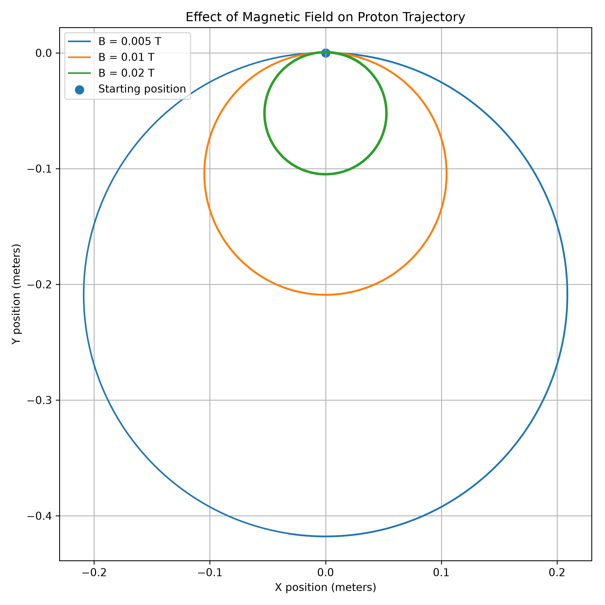

# ARC-1: Magnetic Field Measurement and Particle Simulation
ARC-1 is a magnetic-field measurement and charged-particle simulation project that uses sensors, Arduino, and Python to explore how magnetic fields can be measured, analyzed, and applied to simplified plasma-control concepts.
# Project Goal
The goal of ARC-1 is to design and test a safe, low-voltage system that measures magnetic-field strength and temperature, records experimental data, and uses the measured field values in a Python charged-particle simulation. The project explores the basic engineering concepts behind magnetic plasma control, including sensing, data collection, modeling, feedback, safety, and system improvement.
# System Design

## Magnetic Field Comparison

The simulation was run using a proton traveling initially at 100,000 m/s.

| Magnetic Field | Expected Orbit Radius |
|---|---:|
| 0.005 T | 0.2089 m |
| 0.010 T | 0.1044 m |
| 0.020 T | 0.0522 m |

The results show that increasing the magnetic-field strength decreases the radius of the charged particle's path. Doubling the magnetic field approximately halves the orbit radius.

## Model Assumptions

- The magnetic field is uniform.
- The particle begins at the origin.
- The simulation models a proton.
- Electric fields are not included.
- Collisions and air resistance are ignored.
- The magnetic-field values are simulated rather than measured.